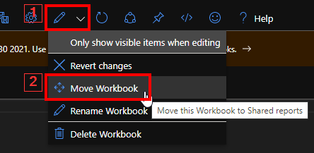

# Private Workbooks Deprecation
Workbooks were available in two modes – private and shared. Private workbooks were accessible only to the author and was the default save mode.  

We removed saving to private and now any new workbook is default saved as shared. This was the first step in deprecating private workbooks. Private workbooks will be deprecated by June 30 2021. 

Next step is to convert your private workbooks to shared is by ‘saving’ or ‘saving as’ these workbooks and continue to use them after June 30 2021. Removing private workbooks simplifies a lot of confusing experiences and support issues that customers are having with private workbooks compared to full Azure Resource based Workbooks. 

Private Workbooks are stored as a different Azure resource type than Shared Workbooks. We are merging these different Azure resource types and making one single standard type. This will allow it to take advantage of all the existing and new functionality available in Azure Workbooks. For example,  

* Shared Workbooks can be queried via Azure Resource Graph (ARG) 
* Shared Workbooks can support top level ARM features like other resource types, including but not limited to 
    * Tags 
    * Activity Log / Change Tracking 
    * Resource locks 
* Shared Workbooks can support ARM templates  
* Shared Workbooks can support "Bring your own storage" (BYOS) feature 
* Shared Workbooks can be saved in region of your choice 

# How does this impact me?
Private workbooks will be availbable in the Azure Portal until **June 30, 2021.**

To continue using your Private Workbooks after June 30, 2021 **you will need to create a copy** before June 30, 2021 by using 'Save' or 'Save As' to make them Shared Workbooks. This will require you to select a subscription, resource group, and region where you have write access. 

This will not change where you find your workbook or the content of your workbook. Any new workbooks you create hereafter will be Shared Workbooks.   

### Things to remember  
1. You'll be able to update (edit and save) existing Private Workbooks until June 30, 2021 as is After June 30, 2021, it will not be possible to save Private workbook and you will need to "save" or "save as"
2. Any new workbook you create will be Shared workbook.   
3. If you attempt to save a private workbook, you will instead be prompted to save it as a new shared workbook
4. 'Save as' on Private Workbook will create Shared Workbook 

# How should you proceed?
### Identify Private Workbooks

You can identify private workbooks and shared workbooks by their icon in the gallery view.

If you are using the new gallery view, then you can additionally identify the share type as shown in the Sharing column.

### Convert Private Workbooks to Shared workbooks
If you choose to migrate your private workbook to a shared one, you can move it to a shared workbook using one of the following methods:
- Save (shows UI and save as shared workbook)

- Save As (defaults to shared workbook)

- Move Workbook

- Copy Link > "Move to Shared Reports"

If you don't want others to have access to your workbook, you can manually change the RBAC to deny access to others.

### Managing Test Workbook Clutter
The simplest way to keep things separate is to save test workbooks to other subscriptions or resource groups. An upcoming change to the workbook gallery will make it easier to filter to specific resource groups to filter to specific resource groups.

There are existing documents about workbook Access control here:
https://docs.microsoft.com/en-us/azure/azure-monitor/visualize/workbooks-access-control

There are no changes to the behaviors of roles, or access control with these changes.

# What happens if I don't Convert
From June 30, 2021, you will not see your private workbooks in Azure Portal. You will be able to retrieve the content of the private workbooks for a month until July 30. 