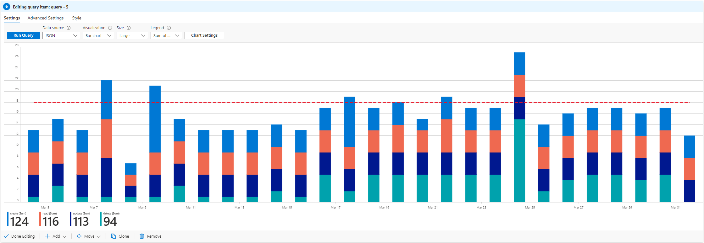
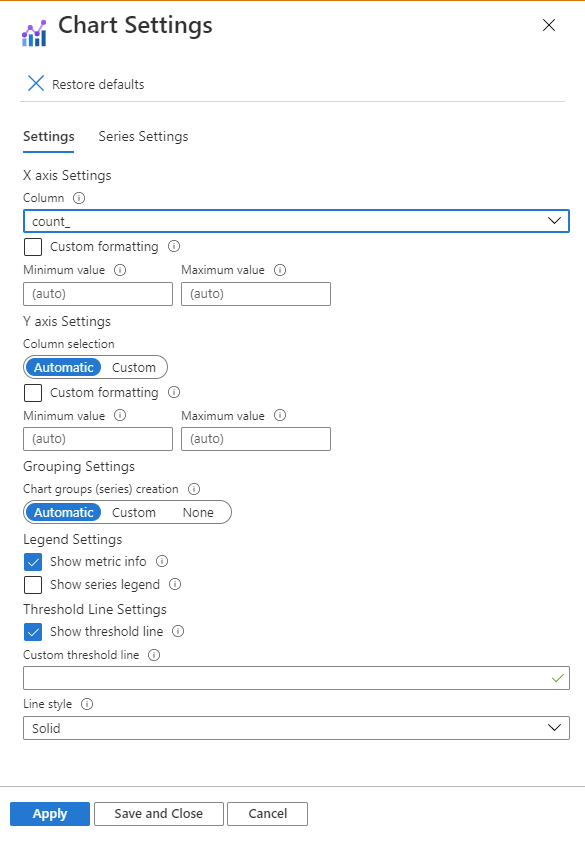
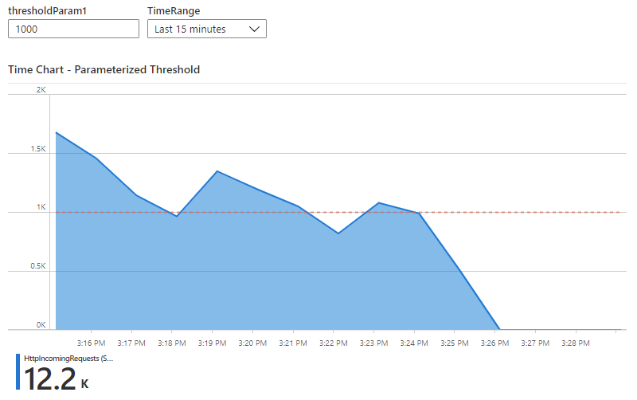

# Chart Visualization

Workbooks allow monitoring data to be presented as charts. Supported chart types include line, bar, bar categorical, area, scatter plots, pie and time. Authors can choose to customize the height, width, color palette, legend, titles, no-data message, etc. of the chart, and customize axis types and series colors using chart settings.

Workbooks supports charts for both analytics logs and metric data sources. Use the links below to learn more about enabling charts for these.

* [Log charts](LogCharts.md)
* [Metric charts](MetricCharts.md)

## Time-series examples
### Area chart

### Segmented line chart

### Segmented bar chart ([Threshold Line enabled](#threshold-line))

### Scatter chart

## Categorical examples
### Pie chart

### Bar categorical or Histogram

# Chart Settings
Authors can use chart settings to customize which fields are used in the chart axes, the axis units, custom formatting, ranges, grouping behaviors, legends, and series colors.

### The Settings tab
The settings tab controls:
* the axis settings, including which fields, custom formating that allows users to set the number formatting to the axis values, and custom ranges.
* grouping settings, including which field, the limits before an "Others" group is created
* legend settings, including showing metrics (series name, colors and numbers) at the bottom, and/or a legend (series names and colors)
* threshold line settings

#### Custom Formatting
The custom formatting is same as Grid's custom formatting except "Custom text for missing values" is not applicable for charts. More description [here](microsoft/Application-Insights-Workbooks/blob/master/Documentation/Visualizations/Grid.md#custom-formatting).

#### Threshold Line
Add a threshold line to the chart at a Y value that you define. Supported chart types include line, bar, bar categorical, area, scatter chart, and time chart. To enable the threshold line on the chart, check the "Show threshold line" checkbox and set the Y value in chart settings in the "Custom threshold line" field.

Alternatively, you can link the Y value to a workbook parameter by inputting the parameter name wrapped in curley brackets (eg. {thresholdParam1}). 

The threshold line will be updated on the chart whenever the linked parameter value is changed.

### The Series tab
The series settings tab lets you adjust the labels and colors shown for series in the chart.
* The `Series name` field is used to match a series in the data, and if matched, the display label and color will be displayed.
* the `Comment` field is useful for template authors, as this comment may be used by translators to localize the display labels

